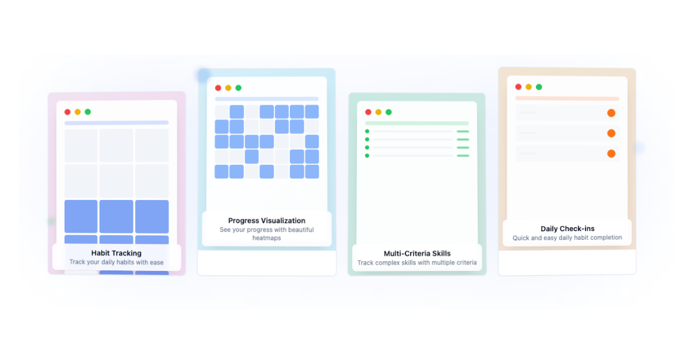
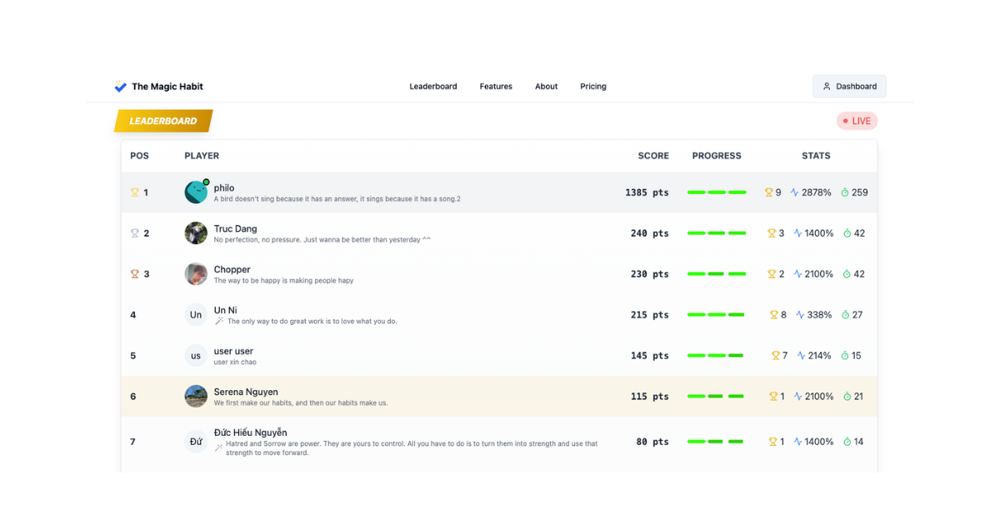
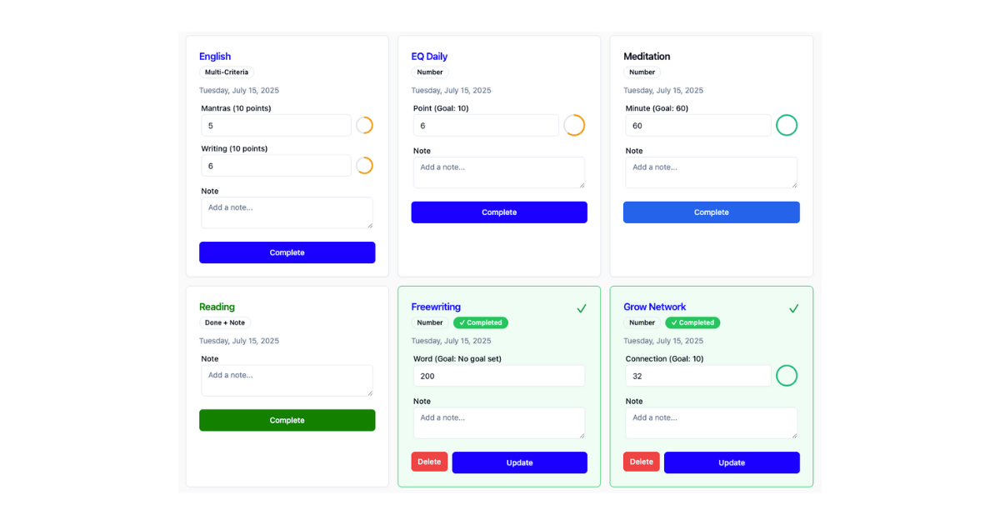
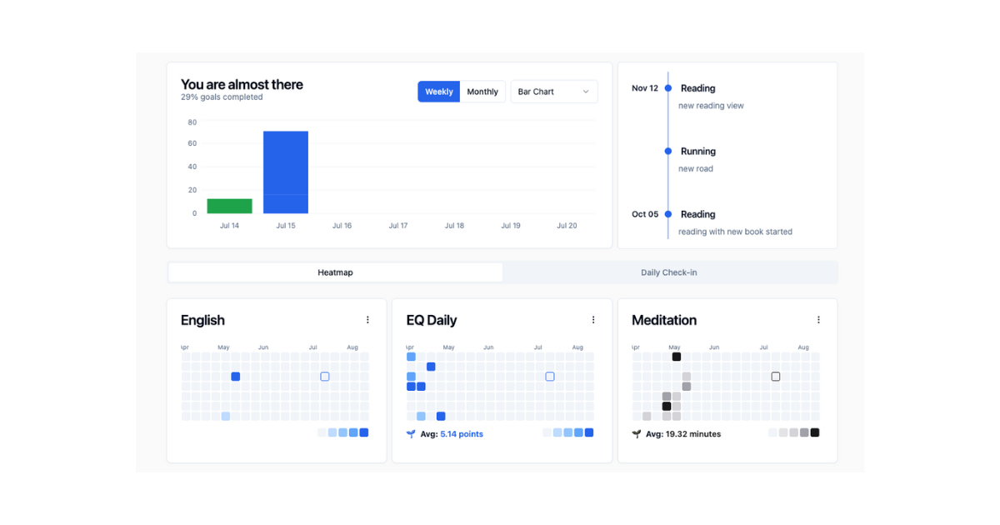

# ✨ The Magic Habit ✨

*Make it so easy you can't say no. Build your habits effortlessly with simple steps that make progress a natural part of your day.*

## 🚀 Features

- **Habit Tracking**: Easily track your daily habits.
- **Progress Visualization**: See your progress with a heatmap view.
- **Cross-Platform**: Use it on the web and on your mobile device.
- **Simple & Clean UI**: A user-friendly interface to help you focus on your habits.

## 📸 Screenshots

Here are some screenshots of the application:

| Features | Leaderboard |
| :---: | :---: |
|  |  |

| Daily Check-in | Chart View |
| :---: | :---: |
|  |  |

## 🛠️ Tech Stack

This project is a monorepo managed with **Nx**.

- **Frontend (Web)**:
    - React
    - TypeScript
    - Vite
    - shadcn/ui
    - Tailwind CSS
    - Zustand for state management
    - React Query for data fetching
    - React Hook Form for forms

- **Backend**:
    - Golang
    - Pocketbase (as a framework)
    - SQLite

- **Mobile**:
    - React Native
    - React Native Paper for UI components

The overall architecture is represented in the diagram below:

## 🗺️ Roadmap

- [x] Web & APIs CI-CD
- [x] Mobile App
- [ ] Mobile Code Push (App Center)
- [ ] Submit to App Stores

## 💡 Inspire & References

- Icons: [Lucide Icons](https://icon-sets.iconify.design/lucide/)
- Backend Framework: [Pocketbase Docs](https://pocketbase.io/docs/)
- UI Color Palette: [Shadcn Colors](https://ui.shadcn.com/colors)
