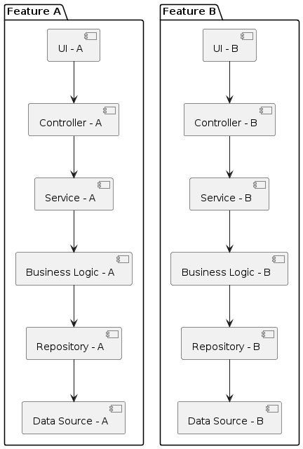

# Mazic

## Tech stack
- Nx monorepo
- React, shadcn/ui, Zustand, React Query, React Hook Form
- Golang, Echo V5, ozzo-dbx, ozzo-validation, Postgres, Pocketbase, Prisma migrations

## Description

This project demonstrates a CRM system built using Vertical Slice Architecture. Each vertical slice represents a distinct feature, such as customer management, sales tracking, or support ticketing, and includes all layers—UI, business logic, and data access—required for that feature

## Roadmap
- [x] CRUD for entities
- [x] RBAC
- [x] i18n
- [ ] CRM features
- [ ] Eslint, Prettier, Husky, Lint-staged, Storybook, Testing, CI/CD
- [ ] Multi-tenancy
- [ ] Notifications
- [ ] Audit logs

## Inspire & References
- Icons: https://icon-sets.iconify.design/lucide/
- Pocketbase: https://github.com/abdokhaire/postgresbase
- Shadcn colors: https://ui.shadcn.com/colors
