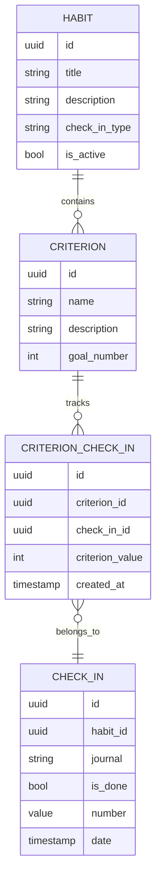
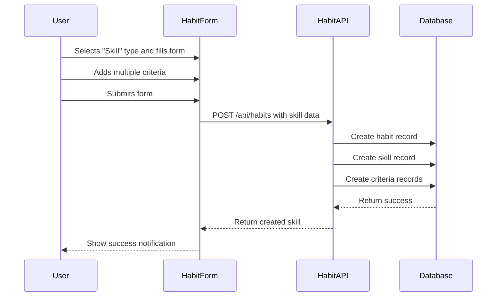
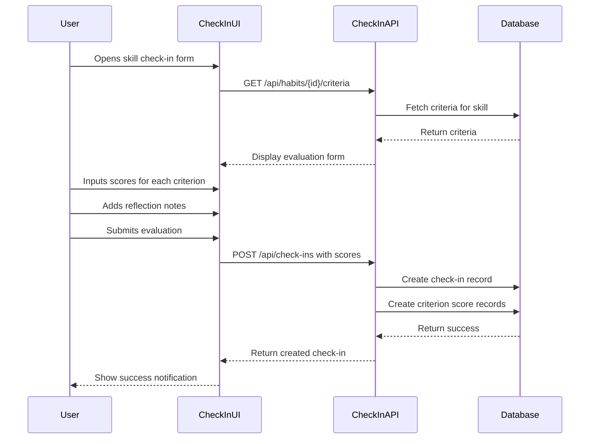
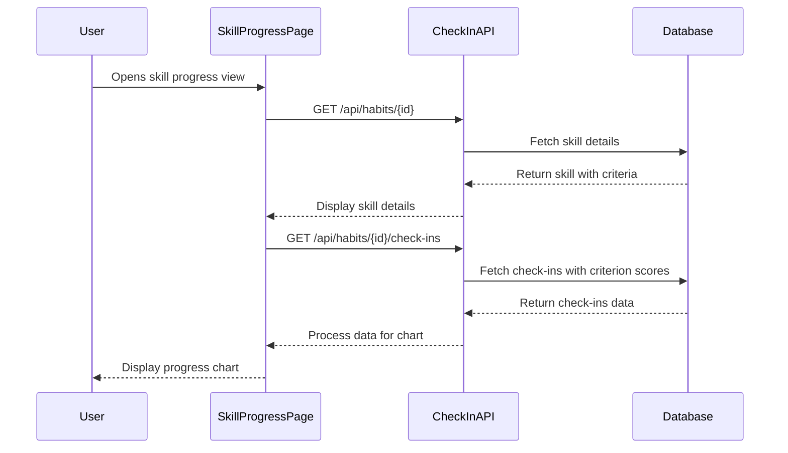

# Technical Design Document: Skill Progress Evaluation System

## 1. Overview

The Skill Progress Evaluation System enables users to track their improvement in specific skills (e.g., "Speaking") through multiple sub-criteria (e.g., Pronunciation, Fluency, Grammar, Vocabulary). Users can input daily scores for each criterion, add reflective notes, and visualize their progress through charts. This feature enhances MagicHabit by providing more structured and detailed habit tracking for skill development.

## 2. Requirements

### 2.1 Functional Requirements

- Users must be able to create skill templates with multiple evaluation criteria
- Users must be able to input daily numerical scores (e.g., 5/8) for each criterion
- System must display progress charts showing score changes across all criteria over time
- Users must be able to add daily notes to reflect on their learning
- All evaluations must be timestamped and organized chronologically

### 2.2 Non-Functional Requirements

- Performance: Charts must load within 2 seconds even with 6+ months of daily data
- Usability: Input interface must be intuitive and require minimal clicks
- Security: Data must be protected and accessible only to the owning user
- Accessibility: Charts must include alternative text descriptions for screen readers
- Compatibility: Feature must work across web and mobile platforms

## 3. Technical Design

### 3.1 Database Schema Changes

Extend the existing habit tracking schema with new entities:



Database migration changes will extend the existing Pocketbase schema:

```go
// Modify existing habit.schema.go to include new skill type
const CheckInTypeSkill = "SKILL"

// Add to existing check-in types
checkInTypes := []string{
    checkInType.DONE,
    checkInType.INPUT_NUMBER,
    checkInType.SKILL, // New type
}
```

### 3.2 API Changes

#### New Endpoints in Existing Controllers

Extend the existing habit and check-in controllers with new endpoints:

```go
// In internal/mods/habit/habit.controller.go
func (c *HabitController) CreateSkill(context ctx.Context) error {
    // Create a skill template with criteria
}

func (c *HabitController) UpdateSkill(context ctx.Context) error {
    // Update skill and its criteria
}

// In internal/mods/check_in/check_in.controller.go
func (c *CheckInController) CreateSkillCheckIn(context ctx.Context) error {
    // Create check-in with multiple criterion scores
}

func (c *CheckInController) GetSkillCheckInHistory(context ctx.Context) error {
    // Get historical check-ins with criterion scores
}
```

#### Request/Response Examples

**Create Skill Template Request:**
```json
{
  "name": "Speaking",
  "description": "English speaking practice",
  "criteria": [
    {
      "name": "Pronunciation",
      "description": "Clarity and accuracy of sounds",
      "goal_number": 10
    },
    {
      "name": "Fluency",
      "description": "Smoothness of speech",
      "goal_number": 10
    },
    {
      "name": "Grammar",
      "description": "Correctness of sentence structure",
      "goal_number": 10
    },
    {
      "name": "Vocabulary",
      "description": "Range and appropriateness of words",
      "goal_number": 10
    }
  ]
}
```

**Create Skill Check-In Request:**
```json
{
  "habit_id": "HABIT_UUID",
  "date": "2023-08-10T00:00:00Z",
  "journal": "Practiced with John. Need to work on past tense forms.",
  "criterion_scores": [
    {
      "criterion_id": "CRITERION1_UUID",
      "criterion_value": 7
    },
    {
      "criterion_id": "CRITERION2_UUID",
      "criterion_value": 6
    },
    {
      "criterion_id": "CRITERION3_UUID",
      "criterion_value": 5
    },
    {
      "criterion_id": "CRITERION4_UUID",
      "criterion_value": 8
    }
  ]
}
```

### 3.3 UI Changes

#### Modify Existing Components

1. **Habit Form Component Modification:**

```tsx
// packages/mazic/src/modules/habit/components/HabitForm.tsx
// Add new skill type option and conditional rendering for criteria

// ... existing code ...
{formData.check_in_type === checkInType.SKILL && (
  <div className="space-y-4">
    <div className="flex items-center justify-between">
      <Label htmlFor="goal_number">Goal Number</Label>
      <Input
        id="goal_number"
        type="number"
        {...register("goal_number", { valueAsNumber: true })}
      />
    </div>
    
    <div>
      <Label className="mb-2 block">Criteria</Label>
      <CriteriaFieldArray control={control} />
    </div>
  </div>
)}
// ... existing code ...
```

2. **Create New Criteria Components:**

```tsx
// packages/mazic/src/modules/habit/components/CriteriaFieldArray.tsx
import { useFieldArray } from 'react-hook-form'
import { Button, Input, Label, Trash2Icon } from '@mazic/ui'

export function CriteriaFieldArray({ control }) {
  const { fields, append, remove } = useFieldArray({
    control,
    name: "criteria"
  });
  
  return (
    <div className="space-y-3">
      {fields.map((field, index) => (
        <div key={field.id} className="flex items-end gap-2 p-3 border rounded">
          <div className="flex-1">
            <Label htmlFor={`criteria.${index}.name`} className="mb-1 block">Name</Label>
            <Input {...register(`criteria.${index}.name`)} />
          </div>
          
          <div className="flex-1">
            <Label htmlFor={`criteria.${index}.weight`} className="mb-1 block">Weight (%)</Label>
            <Input 
              type="number" 
              {...register(`criteria.${index}.weight`, { valueAsNumber: true })} 
            />
          </div>
          
          <Button 
            type="button" 
            variant="ghost" 
            size="icon"
            onClick={() => remove(index)}
          >
            <Trash2Icon className="h-4 w-4" />
          </Button>
        </div>
      ))}
      
      <Button
        type="button"
        variant="outline"
        onClick={() => append({ name: "", description: "", weight: 25 })}
      >
        Add Criterion
      </Button>
    </div>
  )
}
```

3. **Create Skill Check-In Form:**

```tsx
// packages/mazic/src/modules/check-in/components/FormSkillCheckIn/FormSkillCheckIn.tsx
import { useForm } from 'react-hook-form'
import { zodResolver } from '@hookform/resolvers/zod'
import { 
  Button, 
  Card, 
  CardContent, 
  Input, 
  Label, 
  Slider, 
  Textarea 
} from '@mazic/ui'
import { skillCheckInSchema } from '../../schemas/skillCheckIn.schema'

export function FormSkillCheckIn({ habit, checkInEntry, onSubmitForm, onDeleteForm }) {
  const { criteria } = habit
  const maxScore = habit.max_score || 10
  
  const { register, handleSubmit, formState: { errors } } = useForm({
    resolver: zodResolver(skillCheckInSchema),
    defaultValues: checkInEntry || {
      habit_id: habit.id,
      journal: habit.template || '',
      criterion_scores: criteria.map(c => ({ 
        criterion_id: c.id, 
        score: 0 
      }))
    }
  });
  
  return (
    <form onSubmit={handleSubmit(onSubmitForm)}>
      <div className="space-y-4">
        {criteria.map((criterion, index) => (
          <Card key={criterion.id}>
            <CardContent className="pt-4">
              <Label className="mb-1 block font-medium">{criterion.name}</Label>
              <div className="flex items-center gap-4">
                <Slider
                  max={maxScore}
                  step={1}
                  {...register(`criterion_scores.${index}.score`, { 
                    valueAsNumber: true 
                  })}
                />
                <Input
                  type="number"
                  className="w-16"
                  max={maxScore}
                  min={0}
                  {...register(`criterion_scores.${index}.score`, { 
                    valueAsNumber: true 
                  })}
                />
                <span className="text-sm text-muted-foreground">/ {maxScore}</span>
              </div>
            </CardContent>
          </Card>
        ))}
        
        <div>
          <Label htmlFor="journal" className="mb-1 block">Notes</Label>
          <Textarea
            id="journal"
            rows={3}
            {...register("journal")}
          />
        </div>
        
        <div className="flex justify-between">
          {checkInEntry?.id && (
            <Button type="button" variant="outline" onClick={onDeleteForm}>
              Delete
            </Button>
          )}
          <Button type="submit">
            Save Check-In
          </Button>
        </div>
      </div>
    </form>
  )
}
```

4. **Skill Progress Chart Component:**

```tsx
// packages/mazic/src/modules/check-in/components/SkillProgressChart/SkillProgressChart.tsx
import { useMemo } from 'react'
import dayjs from 'dayjs'
import {
  Bar,
  BarChart,
  CartesianGrid,
  Legend,
  ResponsiveContainer,
  Tooltip,
  XAxis,
  YAxis
} from 'recharts'
import { Card, CardContent, CardHeader, CardTitle } from '@mazic/ui'
import { THabit } from '@mazic/shared'

export function SkillProgressChart({ habit, checkIns }) {
  // Transform check-ins data for the chart
  const chartData = useMemo(() => {
    return checkIns.map(checkIn => {
      const dataPoint = {
        date: dayjs(checkIn.date).format('MMM D'),
        dateObj: checkIn.date,
      }
      
      checkIn.criterion_scores.forEach(cs => {
        const criterion = habit.criteria.find(c => c.id === cs.criterion_id)
        if (criterion) {
          dataPoint[criterion.name] = cs.score
        }
      })
      
      return dataPoint
    });
  }, [checkIns, habit.criteria]);
  
  return (
    <Card>
      <CardHeader>
        <CardTitle>{habit.title} Progress</CardTitle>
      </CardHeader>
      <CardContent>
        <ResponsiveContainer width="100%" height={400}>
          <BarChart data={chartData}>
            <CartesianGrid strokeDasharray="3 3" />
            <XAxis 
              dataKey="date" 
              tickMargin={10}
            />
            <YAxis 
              domain={[0, habit.max_score || 10]} 
              tickCount={habit.max_score + 1 || 11}
            />
            <Tooltip />
            <Legend />
            {habit.criteria.map((criterion, index) => (
              <Bar 
                key={criterion.id}
                dataKey={criterion.name}
                fill={`var(--color-accent-${(index % 5) + 1})`}
              />
            ))}
          </BarChart>
        </ResponsiveContainer>
      </CardContent>
    </Card>
  )
}
```

### 3.4 Logic Flow

#### Create Skill Template Flow



#### Daily Evaluation Flow



#### View Progress Chart Flow



### 3.5 Dependencies

This feature will use existing dependencies:

- Frontend:
  - Recharts (already used in dashboard charts)
  - React Hook Form (already used for form handling)
  - Zod (already used for validation)
  - TanStack Query (already used for data fetching)

- Backend:
  - Existing Pocketbase/Golang infrastructure
  - ozzo-validation for validation

### 3.6 Security Considerations

- Ensure proper authorization checks to prevent users from accessing others' skill data
- Validate all user input both on client and server sides
- Apply proper RBAC to new API endpoints
- Sanitize notes input to prevent XSS attacks

### 3.7 Performance Considerations

- Implement pagination for fetching historical check-in data
- Use data aggregation for long-term progress view (weekly/monthly averages)
- Optimize chart rendering with memoization
- Consider caching frequent API calls

## 4. Testing Plan

### Unit Tests

- Test schema validation for skill creation and check-in
- Test service layer functions for creating and retrieving skill data
- Test score calculation utilities

### Integration Tests

- Test full skill creation flow
- Test check-in creation with criterion scores
- Test retrieval of historical data with proper formatting

### UI Tests

- Test form validation and submission
- Test chart rendering with various data sets
- Test responsive behavior across device sizes

## 5. Open Questions

- Should we allow users to change criteria after creation, and if so, how do we handle historical data?
- Do we need to implement a scoring guide or rubric for each criterion?
- Should we add comparative analysis between skills or across time periods?

## 6. Alternatives Considered

- Using a radar chart instead of a bar chart for visualization
  - Rejected because bar charts better show progress over time
- Implementing a separate module for skills instead of extending habits
  - Rejected to maintain consistency with existing habit tracking

## 7. Code Style and Conventions

- Follow existing naming conventions for files and components
- Adhere to existing React patterns with hooks for data fetching
- Implement proper TypeScript interfaces for all new components
- Follow existing Golang patterns for controllers and services

## 8. Implementation Timeline

1. Database schema changes - 2 days
2. Backend API implementation - 3 days
3. Frontend form components - 2 days
4. Chart visualization - 2 days
5. Testing and refinement - 3 days

Total estimated time: 12 days 
