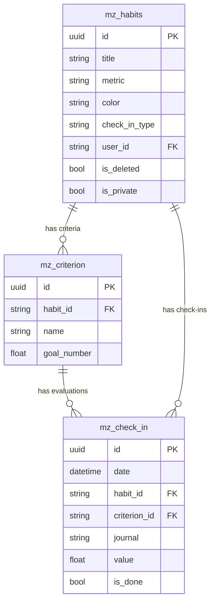
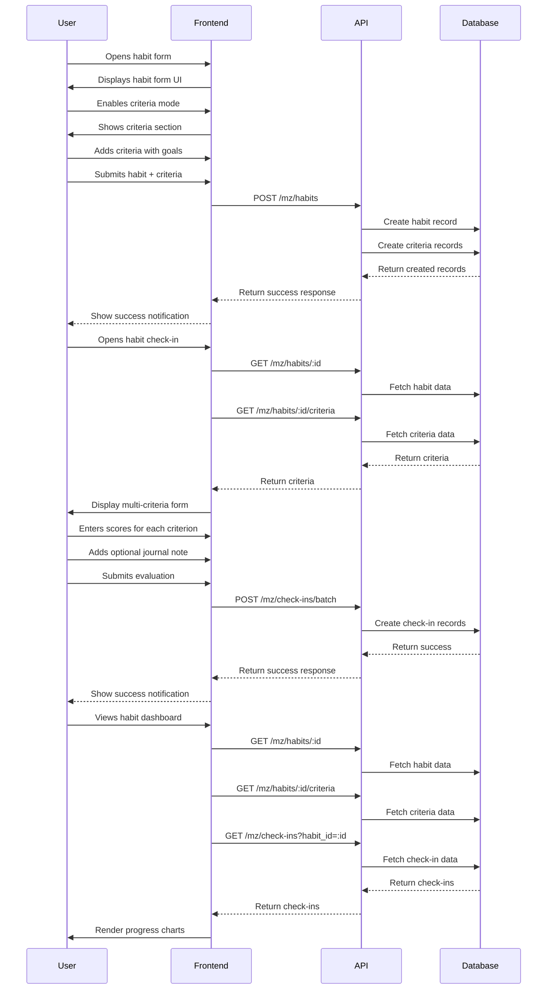

# Technical Design Document: Skill Tracking with Criteria

## 1. Overview
The Skill Tracking with Criteria feature enables users to track the improvement of specific skills through multiple sub-criteria by entering daily scores and viewing progress through charts. Users can create skill templates, input daily evaluations, view progress charts, and add contextual notes for their learning journey.

## 2. Requirements

### 2.1 Functional Requirements
- Users can create skill templates with multiple criteria (e.g., "Speaking" with criteria like Pronunciation, Fluency, etc.)
- Users can input daily scores for each criterion of a tracked skill
- Users can view historical progress through visual charts showing scores per criterion over time
- Users can add daily notes to contextualize their evaluation

### 2.2 Non-Functional Requirements
- The interface must be intuitive and maintain the MagicHabit's "make it so easy you can't say no" philosophy
- Data visualization must clearly show progress trends across multiple criteria
- Data entry should require minimal clicks/interactions
- System must scale to accommodate numerous skills and criteria per user

## 3. Technical Design

### 3.1 Database Schema Changes

We'll extend the existing habit system by adding criteria support. The schema changes include:

1. New `mz_criterion` table (already implemented in migration `1744937173_created_mz_criterion.go`)
2. Updated `mz_check_in` table with criterion relation (already implemented in migration `1744937524_updated_mz_check_in.go`)



The database schema changes have already been implemented with:
- A new `mz_criterion` table with fields for name and goal_number
- Updated `mz_check_in` table with a relation to the criterion table
- A unique constraint to ensure only one check-in per habit-date-criterion combination

### 3.2 API Changes

We'll extend the existing Habit and CheckIn APIs with new endpoints:

#### Criteria Endpoints:
- `GET /mz/habits/:habit_id/criteria` - List criteria for a habit
- `GET /mz/habits/:habit_id/criteria/:id` - Get single criterion
- `POST /mz/habits/:habit_id/criteria` - Create criterion
- `PUT /mz/habits/:habit_id/criteria/:id` - Update criterion
- `DELETE /mz/habits/:habit_id/criteria/:id` - Delete criterion

#### Updated CheckIn Endpoints:
- Modify existing check-in endpoints to support criterion-specific evaluations
- Extend `GET /mz/check-ins` to filter by criterion_id
- Update `POST /mz/check-ins` to accept criterion_id

Example request for creating a skill habit with criteria:
```json
// POST /mz/habits
{
  "title": "Speaking",
  "metric": "Score",
  "color": "emerald",
  "check_in_type": "INPUT_NUMBER",
  "criteria": [
    {
      "name": "Pronunciation",
      "goal_number": 10
    },
    {
      "name": "Fluency",
      "goal_number": 10
    },
    {
      "name": "Grammar", 
      "goal_number": 10
    },
    {
      "name": "Vocabulary",
      "goal_number": 10
    }
  ]
}
```

Example request for daily evaluation:
```json
// POST /mz/check-ins
{
  "habit_id": "habit_id_here",
  "date": "2024-06-18T00:00:00Z",
  "criterion_id": "criterion_id_here",
  "value": 7,
  "journal": "Focused on conversation practice today. Made progress with pronunciation."
}
```

Example batch request for evaluating all criteria at once:
```json
// POST /mz/check-ins/batch
{
  "habit_id": "habit_id_here",
  "date": "2024-06-18T00:00:00Z",
  "items": [
    {
      "criterion_id": "criterion1_id",
      "value": 7
    },
    {
      "criterion_id": "criterion2_id", 
      "value": 6
    },
    {
      "criterion_id": "criterion3_id",
      "value": 8
    },
    {
      "criterion_id": "criterion4_id",
      "value": 5
    }
  ],
  "journal": "Focused on conversation practice today. Noticed improvement in fluency but still struggling with complex vocabulary."
}
```

### 3.3 UI Changes

We'll extend the existing Habit UI components to support criteria:

#### Updates to Existing Components:
1. **Habit Creation/Edit Form**
   - Extend the existing habit form to add criteria management
   - Add support for adding/removing/editing criteria

2. **CheckIn Component**
   - Modify the check-in form to display all criteria for a skill habit
   - Add UI for scoring each criterion individually

3. **Visualization Components**
   - Extend the existing habit visualization to show criteria-specific progress
   - Add stacked bar charts for comparing criteria scores over time

#### New Components:
1. **CriteriaList** - Shows all criteria for a habit
2. **CriteriaForm** - Form for adding/editing criteria
3. **MultiCriteriaCheckInForm** - Form for evaluating all criteria at once
4. **SkillProgressChart** - Enhanced visualization for multi-criteria progress

### 3.4 Logic Flow



### 3.5 Dependencies
No new dependencies required - we'll leverage the existing stack:
- Frontend: React, TanStack Query, React Hook Form, Zod, Recharts
- Backend: Golang, Pocketbase, ozzo-validation, dbx

### 3.6 Security Considerations
- All endpoints will use the existing authentication middleware
- Criteria will inherit the same privacy controls as their parent habits (is_private flag)
- Input validation will be applied to all criteria and evaluation data

### 3.7 Performance Considerations
- Batch operations for submitting multiple criteria evaluations at once
- Query optimization for fetching all criteria evaluations with a single request
- Frontend caching via TanStack Query for evaluation history

## 4. Testing Plan

### Unit Tests
- Backend:
  - Schema validation tests for `criterion.schema.go`
  - Service method tests for criteria CRUD operations
  - Controller tests for new API endpoints
  - Test check-in operations with criteria relation

### Integration Tests
- API endpoint tests for criteria and multi-criteria check-ins
- Database transaction tests for related operations

### UI Tests
- Component tests for criteria management and multi-criteria check-in forms
- User flow tests for creating habits with criteria and submitting evaluations

## 5. Open Questions
- Should we allow templates for skill habits with predefined criteria sets?
- Do we need to track overall skill progress separate from individual criteria?
- How should we handle visualization when a habit has many criteria (e.g., more than 5)?

## 6. Alternatives Considered
- **Separate Skill System**: Initially considered creating separate tables for skills, but chose to extend the habit system for better code reuse and simplicity
- **Denormalized Schema**: Considered storing all criteria scores in a single check-in record as JSON, but chose relational approach for better querying
- **Fixed Criteria Set**: Evaluated using a fixed set of criteria for all skills, but opted for flexible user-defined criteria

## 7. Code Style and Conventions
- Follow existing MagicHabit patterns for:
  - Backend: Controller-Service-Schema pattern with standardized validation
  - Frontend: Component composition with shared UI elements and custom hooks
- Maintain consistent naming patterns:
  - Backend files: `criterion.controller.go`, `criterion.service.go`, etc.
  - Frontend components: `CriteriaForm.tsx`, `MultiCriteriaCheckInForm.tsx`, etc. 
